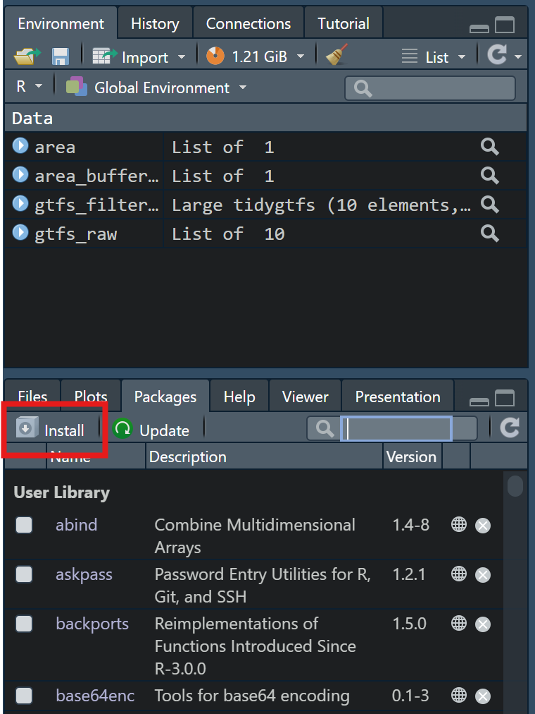
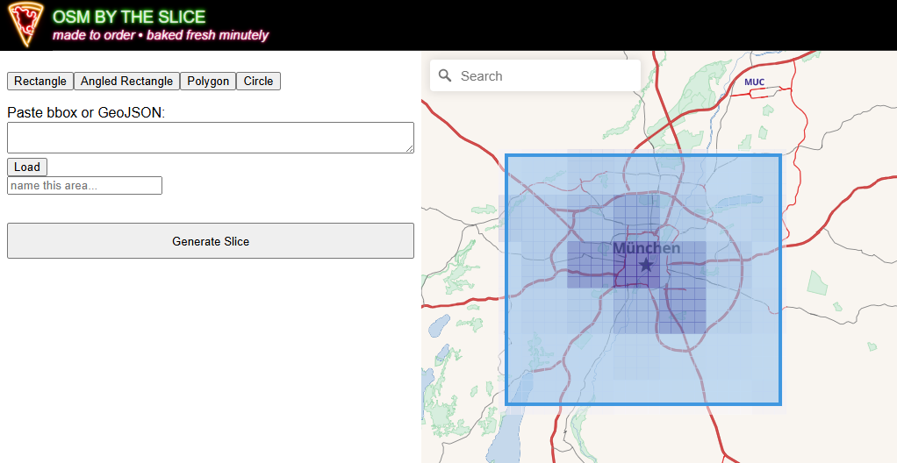
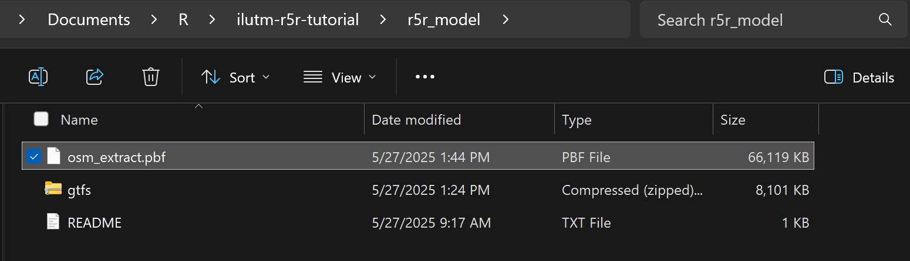
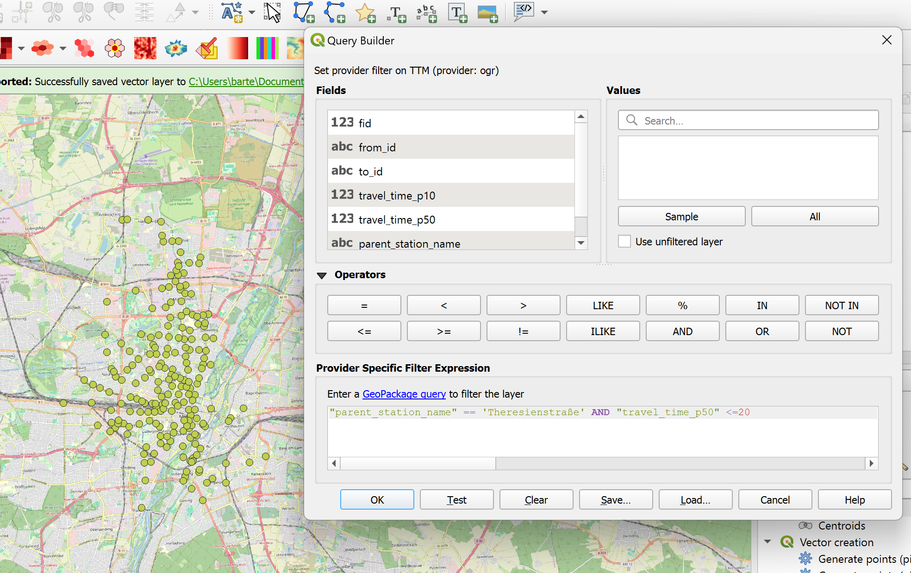
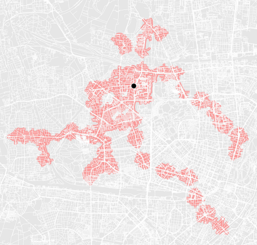

```{r}
library(ggplot2)
```


# Introduction

In this tutorial you will be introduced to [r5r](https://ipeagit.github.io/r5r/): an interface to the [R5](https://github.com/conveyal/r5) routing engine developed by Conveyal.
R5 (r5r) allows you to do "rapid, realistic" routing on multimodal networks. It's very flexible, enabling
intermodal analyses and has the key strength of retaining the full detail of the public transport timetable.
If you're more familiar with python, you can consider using [r5py](https://github.com/r5py/r5py) instead - although it may not have all of the same functionality.

As an example, we're going to be analyzing accessibility by public transport to beer gardens 🚇🍻


The tutorial consists of the following main steps

1. Installing r5r
2. GTFS preparation
3. Loading spatial data into R
4. Creating an Isochrone


In addition to r5r, you will be exposed to several other useful R packages: [dplyr](https://dplyr.tidyverse.org/) (for working with data tables), [sf](https://r-spatial.github.io/sf/) (for working with geodata), and [tidytransit](https://github.com/r-transit/tidytransit) (for working with GTFS data). These are all very
powerful packages that can make your life a lot easier if you learn how to use them! You're encouraged 
to look into the documentation of these packages for more information.


# Installing `r5r`

All the packages listed below (including `r5r`) can be installed by clicking "packages > install"
on the sidebar and searching for the package name or by executing the following command: `install.packages("package_name_here")`




Since R5 (the routing engine itself) is written in java, we need to install the Java Development Kit
to make `r5r` work. Specifically we need version 21. You can install it here: https://www.oracle.com/de/java/technologies/downloads/#java21


With that done, we can load all the packages we'll be using today.
```{r}
library(tidyverse)
library(sf)
library(tidytransit)

options(java.parameters = '-Xmx4G') # we need to allocate RAM for r5r to work. You can increase this depending on your system resources.
library(r5r)
```


# GTFS Preparation

1. Download data from: https://gtfs.de/ - pick "Deutschland gesamt"
2. Move the zip file into the "raw_data" folder
3. Using the full feed for all of Germany in r5r will require a lot of resources. Since we'll be 
analyzing a single city - lets filter the feed so that it is smaller. We'll be using `tidytransit` for this.
4. Let's first load in geodata representing the area we'll be trimming to (in this case - Munich). We'll use `st_read` from the `sf` package for this. It can handle all typical geospatial file types (`.shp`,`.gpkg`,etc.)

```{r}
area <- st_read("./raw_data/munich_admin.gpkg")

ggplot()+
  geom_sf(data  = area)

```
5. It's good practice to buffer our study area to avoid any edge effects. Let's buffer our area by 5 km. NOTE: in this analysis we're just going to be looking at accessibility to beer gardens in Munich. We aren't considering any that are in the municipalities around the city. If your destinations extend beyond the border of your city, you may need to buffer your study area significantly! (>>5 km)
6. We've seen how to do this in QGIS, let's use `sf` this time

```{r}
area_buffered <- st_transform(area,crs = 25832) # switch crs to projected (ETRS89 / UTM zone 32N)

area_buffered <- st_union(area_buffered) # join geometries 

area_buffered <- st_buffer(area_buffered, 5000) # buffer by 5km

area_buffered <- st_transform(area_buffered,crs = 4326) #switch back to WGS84 for filtering the GTFS feed


ggplot()+
  geom_sf(data = area_buffered)+
  geom_sf(data = area)
```
7.Let's load in the GTFS feed we downloaded and trim it. We can see that the number of stops in the feed has been significantly reduced.
```{r}

gtfs_raw <- read_gtfs("./raw_data/latest.zip",encoding = "UTF-8") # path should point to the GTFS feed you downloaded

gtfs_filtered <- filter_feed_by_area(gtfs_raw,st_bbox(area_buffered))


tribble(~n_stops_raw, ~n_stops_filtered,
        nrow(gtfs_raw$stops), nrow(gtfs_filtered$stops))
```


8. Let's save the filtered feed. R5 will use this to build a network, you can also use it for other public transport analyses 
(refer to previous tutorials). Tip: `tidytransit` has a lot of great functionality for this!
```{r}

write_gtfs(gtfs_filtered,"./r5r_model/gtfs.zip")

```


# `r5r` Set Up

1. Before running any more code we need to supply the correct data. So far we have prepared the GTFS data, but we also need a street network. R5 uses an extract of OSM data to build the street network. To do this, it needs to be provided with a `.pbf` file. This can be found on [Geofabrik](http://download.geofabrik.de/) or https://slice.openstreetmap.us/. OSM by the slice is recommended because it has a cool name and because you can select the exact area you're interested in (reducing network size, improving performance).
2. Just as when we were trimming the GTFS feed, extract an area larger than the city itself.



3. Save the `.pbf` file to the `/r5r_model/` folder. The folder should look like this:


4. We can now tell r5 to build the network. Tip: if you are sure you aren't modifying the GTFS or `.pbf` data, you can turn `overwrite = F` to avoid rebuilding the model (faster).

```{r}
r5r_core <- setup_r5(data_path = "./r5r_model", verbose = FALSE,overwrite = T)
```
# OD Data

We need some data to use for origins and destinations. Our destinations will be beer gardens. The data is provided for you. It was prepared using an Overpass API query (as in previous tutorials).


```{r}
beergardens <- st_read("raw_data/biergarten.gpkg")

ggplot()+
  geom_sf(data = area)+
  geom_sf(data = beergardens)
```

For our origins, we'll use public transport stops. As we discussed in lecture, a single "stop" may be represented by multiple in a GTFS feed (e.g., a bus stop on both sides of the street). We can take some steps to simplify this. We will group all stops that share the same value for `parent_station` and then keep a single coordinate by taking the average. Be aware that solving this in a line of code is often too good to be true. GTFS data often contains mistakes, and may require more careful cleaning!

```{r}
stops <- summarize(group_by(gtfs_filtered$stops, parent_station),
                   stop_lat = mean(stop_lat),
                   stop_lon = mean(stop_lon),
                   parent_station_name = first(stop_name))  
stops
```

As a final step lets convert the table to geodata and filter it down to our study area.

```{r}
stops <- st_as_sf(stops,coords = c("stop_lon","stop_lat"),crs = 4326,remove = F)

stops <-st_filter(stops,area) #apply spatial filter

stops
```

```{r}
ggplot()+
  geom_sf(data = area)+
  geom_sf(data = stops, color = "blue")+
  geom_sf(data = beergardens, size = 2)
```
<!--
As we can see, this is a lot of public transport stops! We can continue cleaning this up - but for the purpose of the exercise, let's use data that we've used in a previous tutorial (rail stops). The beer garden data was provided as a `.gpkg` which we were able to read using `st_read()`. As this data is a `.csv` we will use `read_csv()` and then convert it into a geodata format.

```{r}
stops <- read_csv("./raw_data/Munich_Stations.csv")

stops <- st_as_sf(stops,coords = c("lon","lat"),crs = 4326,remove = F)

ggplot()+
  geom_sf(data = area)+
  geom_sf(data = stops, color = "blue")+
  geom_sf(data = beergardens, size = 2)
```

-->
Before we start using r5r, lets format our data. The origins and destinations should have an `id` column. `stops` already has this, but `beergardens` does not. Let's add a new column called `id`, and set the values to equal `osm_id`.

```{r}
beergardens
```


```{r}
beergardens <- mutate(beergardens, id = osm_id)
stops <- mutate(stops, id = parent_station)

beergardens
```


# Travel Time Matrix

The main functionality of r5r is the ability to calculate a travel time matrix. Knowing the travel time between pairs of points is useful on its own. It can also be used if you want more control over your accessibility calculations. For example, if you calculate a travel time matrix between pairs of public transport stops, you can calculate the access (origin --> first public transport stop) and egress (last public transport stop --> destination) legs of the trip independently. In other words, combining the output of r5r with the QGIS-based accessibility calculations we did in earlier tutorials.

Let's give it a shot:

tip: there are many other settings you can change, you're encouraged to read the documentation of r5r to see what is possible! The [documentation](https://ipeagit.github.io/r5r/) has many nice examples!

- `stops`: our origins are the public transport stops
- `destinations`: our destinations are the public transport stops
- `mode`: the primary mode is public transport (which includes walking for access and transfers)
- `mode_egress`: the egress mode is walking
- `departure_datetime`: the time trips start
- `time_window`: set to 60. A travel time matrix will be calculated for each minute, for 60 minutes after the departure time. This allows for us to account for the variability in travel times. Imagine we ran our analysis only at 8:00 and we just missed a departure of an S-Bahn at 7:59, the travel time that we'd calculate would be severly penalized by excessive waiting. This parameter can be reduced (default is 10) as it can be computationally expensive. It's increasingly important in suburban and rural areas where service frequencies are low.
- `percentiles`: this corresponds to the `time_window`. a value of 50 will report the median travel time. We can specify multiple percentiles by using a vector `c()`
- `max_walk_time`: max time for access, egress, and transfers by walking
- `walk_speed`: (kph)
- `max_ride`: maximum # of transfers


```{r}

TTM<-
travel_time_matrix(
  r5r_core,
  origins = stops, 
  destinations = stops, 
  mode = c("TRANSIT"),  
  mode_egress = "WALK", 
  departure_datetime = as.POSIXct("26-05-2025 9:00:00", format = "%d-%m-%Y %H:%M:%S"), #its important that the date and time is within your GTFS feed
  time_window = 10L, # 
  percentiles = c(10,50),
  max_walk_time = 10,
  max_trip_duration = 30L,
  walk_speed = 4,
  max_rides = 3,
)

TTM
```

The impact of the time_frame can be quite significant! The percent of OD pairs that had a 50th percentile travel time > 30 min and a 10th percentile travel time <30 min:

```{r}
TTM <- mutate(TTM,tt_diff = travel_time_p50 - travel_time_p10)

print(paste0(round(sum(is.na(TTM$tt_diff)) / length(TTM$tt_diff)*100,0),"%"))
```

Those that could be reached, were this much slower:
```{r}
TTM$tt_diff%>%na.omit()%>%summary()

TTM<-TTM%>%select(-tt_diff)
```
Let's get the travel time matrix ready for an export. We will restructure the data so that the geometry of the destination stops (`to_id`) is added to each row. We will also add the name of the origin station so that the data is easier to work with. This is a similar operation to a VLOOKUP in excel. We use the `from_id` and `to_id` fields as they represent the `parent_station`. 


For more guidance on `dplyr` functions (like `left_join()`) check out this [cheat sheet](https://nyu-cdsc.github.io/learningr/assets/data-transformation.pdf)

```{r}
# join the geometry of the destination station
geometry_to_join <- select(stops,id) # drop unnecessary cols
geometry_to_join <- rename(geometry_to_join,to_id = "id") # rename "id" to "to_id" so that the data is joined as expected

TTM <-
  left_join(TTM, 
            geometry_to_join,
            by = "to_id")


# join the station name of the origin station

names_to_join <- select(stops,parent_station_name,id) # drop unnecessary cols
names_to_join <- st_drop_geometry(names_to_join) # drop geometry
names_to_join <- rename(names_to_join,from_id = "id") # rename "id" to "from_id" so that the data is joined as expected


TTM <-
  left_join(TTM, 
            names_to_join,
            by = "from_id")

TTM <- st_as_sf(TTM)

TTM
```

This format is easier to interpret if we take a single stop. For example, lets find all stops that can be reached from Theresienstraße within a median travel time of 20 minutes.

```{r}
ts_stops_20 <- filter(TTM,parent_station_name == "Theresienstraße", travel_time_p50 <= 20)


ggplot()+
  geom_sf(data = area)+
  geom_sf(data = ts_stops_20, color = "lightblue")+
  geom_sf(data = filter(stops,parent_station_name == "Theresienstraße"), color = "blue")
```

Let's export this so that we can work with it in QGIS.

```{r}
st_write(TTM,"./output/TTM.gpkg",append = F)
```
We can achieve the same result as above by doing the following:




Then, by using what you've learned in previous tutorials, you can create service areas:




