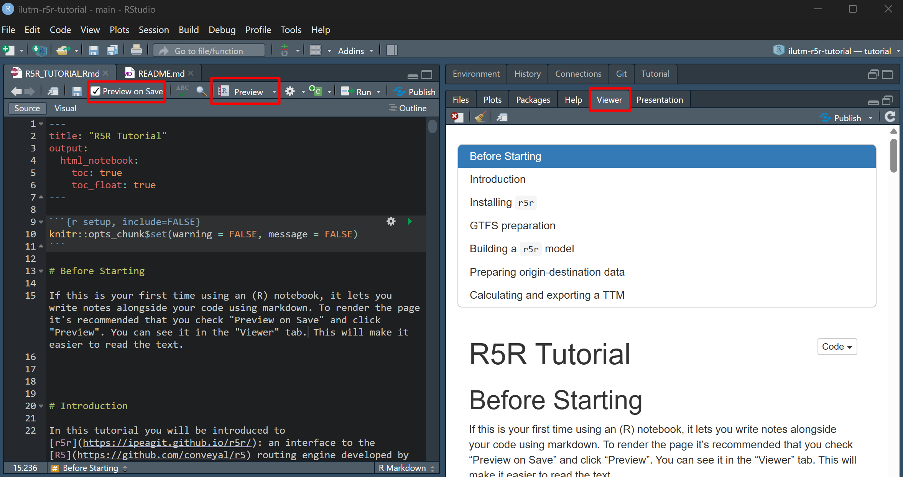
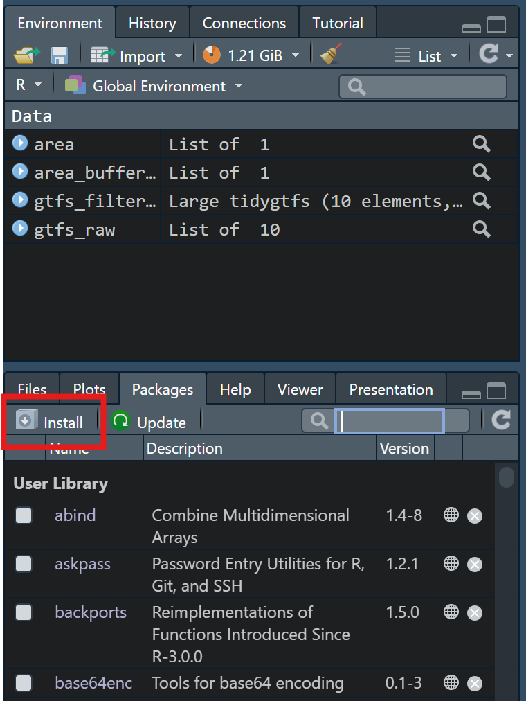
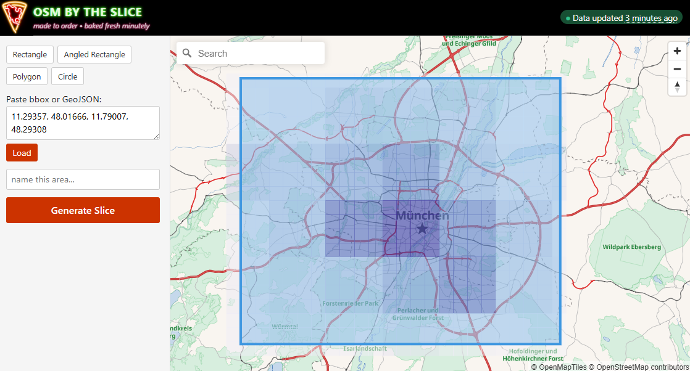
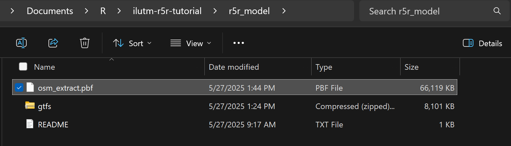
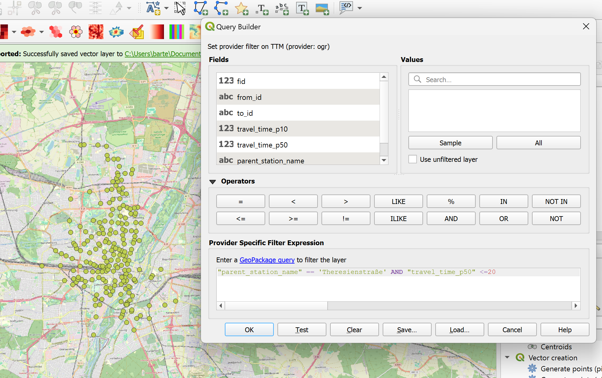
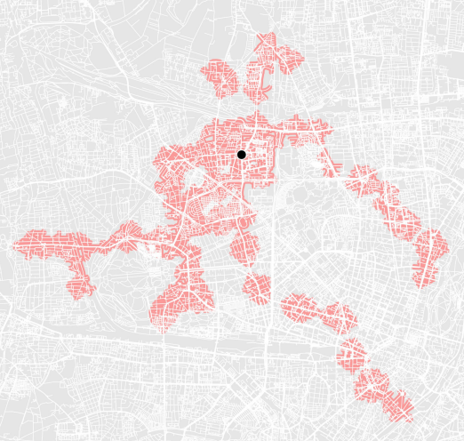

```{r setup, include=FALSE}
knitr::opts_chunk$set(warning = FALSE, message = FALSE) 
```

# Before Starting

If this is your first time using an (R) notebook, it lets you write notes alongside your code using markdown. To render the page it's recommended that you check "Preview on Save" and click "Preview". You can see it in the "Viewer" tab. This will make it easier to read the text.

{width="600px"}


# Introduction

In this tutorial you will be introduced to [r5r](https://ipeagit.github.io/r5r/): an interface to the [R5](https://github.com/conveyal/r5) routing engine developed by Conveyal. R5 allows you to do "rapid, realistic" routing on multimodal networks. It's very flexible, enabling intermodal analyses and has the key strength of retaining the full detail of the public transport timetable. If you're more familiar with python, you can consider using [r5py](https://github.com/r5py/r5py) instead - although it may not have all of the same functionality.

This tutorial is for `r5r version 2.40`

The tutorial consists of the following main steps:

1.  Installing `r5r`
2.  GTFS preparation
3.  Building a `r5r` model
4.  Preparing origin-destination data
5.  Calculating and exporting a TTM
6.  Using the `isochrone()` function
7.  Using the `accessibility()` function 

In addition to r5r, you will be exposed to several other useful R packages: [dplyr](https://dplyr.tidyverse.org/) (for working with data tables), [sf](https://r-spatial.github.io/sf/) (for working with geodata), and [tidytransit](https://github.com/r-transit/tidytransit) (for working with GTFS data). These are all very powerful packages that can make your life a lot easier if you learn how to use them! You're encouraged to look into the documentation of these packages for more information.

**Tip: you can modify this file and use it as a template to help you complete your project ;)**

# Installing `r5r`

All the packages listed below (including `r5r`) can be installed by clicking "packages \> install" on the sidebar and searching for the package name or by executing the following command: `install.packages("package_name_here")`

{width="300px"}
```{r, eval=FALSE}
# note: you only need to run this once!

#install.packages("tidyverse")
#install.packages("tidytransit")
#install.packages("sf")
#install.packages("r5r")
```


Since R5 (the routing engine itself) is written in java, we need to install the Java Development Kit (JDK) to get it to work. Specifically we need version **21**. Using the `rJavaEnv` package makes it straight forward:

Note: you have to copy the code and paste it into your console for it to work correctly. When prompted, type in `yes` to download the JDK.

```{r}
# note: you only need to run this once!
#install.packages("rJava")
#install.packages('rJavaEnv')

# check version of Java currently installed (if any) 
#rJavaEnv::java_check_version_rjava()

# install Java 21
#rJavaEnv::java_quick_install(version = 21)

```
Alternatively, you can download it here: <https://adoptium.net/temurin/releases?version=21&os=any&arch=any>


Once that's done, we can load all the packages we'll be using today.

```{r}
library(tidyverse)
library(sf)
library(tidytransit)

options(java.parameters = '-Xmx4G') # we need to allocate RAM for r5r to work. You can increase this depending on your system resources.
library(r5r)

```


# GTFS preparation

-   Download data from: <https://gtfs.de/de/feeds/> - pick "Deutschland gesamt"
-   Move the zip file into the `/raw_data/` folder (saved as `latest.zip`) - **DON'T** unzip it!
- **Note: if you want to follow along without downloading anything, simply rename `/raw_data/latest_example.zip` to `/raw_data/latest.zip`**
-   Using the full feed for all of Germany will require a lot of resources. Since we'll be analyzing a single city - lets filter the feed so that it is smaller. We'll be using `tidytransit` for this.
-   Let's first load in geodata representing the area we'll be trimming to (in this case - Munich). We'll use `st_read()` from the `sf` package for this. It can handle all typical geospatial file types (`.shp`,`.gpkg`,etc.)

```{r}
area <- st_read("./raw_data/munich_admin.gpkg")

ggplot()+
  geom_sf(data  = area)

```

-   It's good practice to buffer our study area to avoid any edge effects. Let's buffer our area by 5 km. NOTE: in this tutorial we're just going to be looking at accessibility within Munich. If your destinations extend beyond the border of your study area, you may need to buffer your study area significantly! (\>\>5 km)
-   We've seen how to do this in QGIS, let's use `sf` this time
- Before starting, we make sure our data is using a **projected** CRS that is appropriate for our study area. You can use <https://spatialreference.org/> to find an appropriate one. In our case, we'll use ETRS89 / UTM zone 32N (25832)

```{r}
CRS_PROJECTED <- 25832
BUFFER_DISTANCE <- 5000
```


```{r}
area_buffered <- st_transform(area,crs = CRS_PROJECTED) # switch crs to projected 

area_buffered <- st_union(area_buffered) # join geometries 

area_buffered <- st_buffer(area_buffered, BUFFER_DISTANCE) # buffer by 5km

area_buffered <- st_transform(area_buffered,crs = 4326) # switch back to WGS84 for filtering the GTFS feed


ggplot()+
  geom_sf(data = area_buffered)+
  geom_sf(data = area)
```

-   Let's load in the GTFS feed we downloaded and trim it.

```{r}

gtfs_raw <- read_gtfs("./raw_data/latest.zip",encoding = "UTF-8") # path should point to the GTFS feed you downloaded

gtfs_filtered <- filter_feed_by_area(gtfs_raw,st_bbox(area_buffered))

```

-   We can see that the number of stops in the feed has been significantly reduced.

```{r echo=FALSE}

tribble(~n_stops_raw, ~n_stops_filtered,
        nrow(gtfs_raw$stops), nrow(gtfs_filtered$stops))
```

- There's (currently) an issue where the gtfs feed doesn't correctly represent large stops (ones using the [parent station](https://gtfs.org/documentation/schedule/reference/#stopstxt:~:text=or%20alight%20vehicles.-,parent_station,-Foreign%20ID%20referencing)). A quick fix for for this is to simply remove all values under `parent_station`
- Note: the issue appears to be caused by the missing `location_type`
- Let's take a look at the `stops.txt` table

```{r}
gtfs_filtered$stops
```

- to remove all values for `parent_station` we'll replace them with `NA`

```{r}
# first let's make a copy 

gtfs_filtered_cleaned <- gtfs_filtered

gtfs_filtered_cleaned$stops$parent_station <- NA

gtfs_filtered_cleaned$stops
```

- Let's save the filtered (+cleaned) feed. R5 will use this to build a network, you can also use it for other public transport analyses. Tip: `tidytransit` has a lot of great functionality for this!

```{r}

write_gtfs(gtfs_filtered_cleaned,"./r5r_model/gtfs.zip")

```

# Building a `r5r` model

-   Before running any more code we need to supply R5 the data it needs to build the network.
-   So far we have prepared the GTFS data, but we also need a street network.
-   R5 uses an extract of OSM data to build the street network. To do this, it needs to be provided with a `.pbf` file. This can be found on [Geofabrik](http://download.geofabrik.de/) or <https://slice.openstreetmap.us/>.
-   OSM by the slice is recommended because it has a cool name and because you can select the exact area you're interested in (reducing network size, improving performance)
-   Just as when we were trimming the GTFS feed, we need an area larger than the study area
- To do this, we'll get the coordinates of the bounding box for our buffered area
- We can then paste these coordinates into OSM by the slice

```{r}
area_buffered_bbox <- st_bbox(area_buffered)

print(paste(round(area_buffered_bbox,5),collapse = ", "))
```



-   Save the `.pbf` file to the `/r5r_model/` folder. The folder should look like this: 


-   We can now tell r5 to build the network.

-   Tip: if you are sure you aren't modifying the GTFS or `.pbf` data any further, you can turn `overwrite = FALSE` to avoid rebuilding the model (faster)

```{r}
r5r_network <- build_network(
  "./r5r_model",
  verbose = FALSE,
  temp_dir = FALSE,
  elevation = "TOBLER",
  overwrite = TRUE
)
```

# Preparing origin-destination data
-   In this tutorial we'll use public transport stops as our origins and destinations.
-   As we discussed in lecture, a single "stop" may be represented by multiple in a GTFS feed (e.g., a bus stop on both sides of the street).
-   We can take some steps to simplify this. We will group all stops that share the same value for `parent_station` and then keep a single coordinate by taking the average. Be aware that solving this in a line of code is often too good to be true. GTFS data often contains mistakes, and may require more careful cleaning!

```{r}
stops <- summarize(group_by(gtfs_filtered$stops, parent_station),
                   stop_lat = mean(stop_lat),
                   stop_lon = mean(stop_lon),
                   parent_station_name = first(stop_name))  
stops
```

-   let's convert the table to geodata and filter it down to our study area.

```{r}
stops <- st_as_sf(stops,coords = c("stop_lon","stop_lat"),crs = 4326,remove = F)

stops <-st_filter(stops,area) #apply spatial filter

stops
```

```{r echo=FALSE}
ggplot()+
  geom_sf(data = area)+
  geom_sf(data = stops, color = "blue")
```

-   Finally, let's format our data. The origins and destinations should have an `id` column. Let's add a new column called `id`, and set the values to equal `parent_station`.

```{r}
stops <- mutate(stops, id = parent_station)

stops
```

# Calculating and exporting a TTM

The main functionality of `r5r` is the ability to calculate a travel time matrix. Knowing the travel time between pairs of points is useful on its own. It can also be used if you want more control over your accessibility calculations. For example, if you calculate a travel time matrix between pairs of public transport stops, you can calculate the access (origin --\> first public transport stop) and egress (last public transport stop --\> destination) legs of the trip independently. In other words, combining the output of r5r with the QGIS-based accessibility calculations we did in earlier tutorials.

Let's give it a shot:

tip: there are many other settings you can change, you're encouraged to read the documentation of `r5r` to see what is possible! The [documentation](https://ipeagit.github.io/r5r/) has many nice examples!

-   `origins`: our origins are the public transport stops
-   `destinations`: our destinations are the public transport stops
-   `mode`: the primary mode is public transport (which includes walking for access and transfers)
-   `mode_egress`: the egress mode is walking
-   `departure_datetime`: start time
-   `time_window`: A travel time matrix will be calculated for each minute, for `time_window` minutes after the departure time. This allows for us to account for the variability in travel times. Imagine we ran our analysis only at 8:00 and we just missed a departure of an S-Bahn at 7:59, the travel time that we'd calculate would be severely penalized by an excessive wait time. Calculating travel times over a period of time lets us mitigate this. This parameter can be reduced (default is 10) as it can be computationally expensive. It's increasingly important in suburban and rural areas where service frequencies are low.
-   `percentiles`: this corresponds to the `time_window`. A value of 50 will return the median travel time. We can specify multiple percentiles by using a vector `c()`
-   `max_walk_time`: max time for access, egress, and transfers by walking
-   `walk_speed`: (kph)
-   `max_ride`: maximum \# of transfers

```{r}

TTM<-
travel_time_matrix(
  r5r_network,
  origins = stops, 
  destinations = stops, 
  mode = c("TRANSIT"),  
  mode_egress = "WALK", 
  departure_datetime = as.POSIXct("03-06-2026 8:00:00", format = "%d-%m-%Y %H:%M:%S"), #its important that the date and time is within your GTFS feed
  time_window = 60L,  
  percentiles = c(10,50),
  max_walk_time = 10,
  max_trip_duration = 30L,
  walk_speed = 4,
  max_rides = 3,
)

TTM
```

The impact of the `time_window` parameter can be quite significant on an analysis! In this example we calculated:

-   the 10th percentile travel time (meaning 10% of trips are at least this fast)
-   the 50th percentile travel time (meaning 50% of trips are at least this fast)

The proportion of OD pairs that had a 50th percentile travel time \> 30 min and a 10th percentile travel time \<= 30 min:

```{r}
TTM <- mutate(TTM,tt_diff = travel_time_p50 - travel_time_p10)

print(round(sum(is.na(TTM$tt_diff)) / length(TTM$tt_diff),1))
```

For those with a 10th and 50th percentile travel time \<= 30 min, the distribution of the difference between the two is as follows:

```{r}
TTM$tt_diff%>%na.omit()%>%summary()

TTM<-TTM%>%select(-tt_diff)
```

Let's get the travel time matrix ready for an export. We will restructure the data so that the geometry of the destination stops (`to_id`) is added to each row. We will also add the name of the origin station so that the data is easier to work with. This is a similar operation to a VLOOKUP in excel. We use the `from_id` and `to_id` fields as they represent the `parent_station`.

For more guidance on `dplyr` functions (like `left_join()`) check out this [cheat sheet](https://nyu-cdsc.github.io/learningr/assets/data-transformation.pdf)

```{r}
# join the geometry of the destination station
geometry_to_join <- select(stops,id) # drop unnecessary cols
geometry_to_join <- rename(geometry_to_join,to_id = "id") # rename "id" to "to_id" so that the data is joined as expected

TTM <-
  left_join(TTM, 
            geometry_to_join,
            by = "to_id")


# join the station name of the origin station

names_to_join <- select(stops,parent_station_name,id) # drop unnecessary cols
names_to_join <- st_drop_geometry(names_to_join) # drop geometry
names_to_join <- rename(names_to_join,from_id = "id") # rename "id" to "from_id" so that the data is joined as expected


TTM <-
  left_join(TTM, 
            names_to_join,
            by = "from_id")

TTM <- st_as_sf(TTM)

TTM
```

This data format is easier to interpret if we look at a single stop. For example, lets find all stops that can be reached from Theresienstraße within a median travel time of \<= 20 minutes.

```{r}
ts_stops_20 <- filter(TTM,parent_station_name == "Theresienstraße", travel_time_p50 <= 20)


ggplot()+
  geom_sf(data = area)+
  geom_sf(data = ts_stops_20, color = "lightblue")+
  geom_sf(data = filter(stops,parent_station_name == "Theresienstraße"), color = "blue")
```

Let's export this (& the stops) so that we can work with it in QGIS.

```{r}
st_write(TTM,"./output/TTM.gpkg",append = F)

st_write(stops, "./output/stops.gpkg", append = F)
```

We can achieve the same result as above by doing the following:



Then, by using what you've learned in previous tutorials, you can create service areas, which could look something like this:



# Using the `isochrone()` function

As of `r5r version 2.4` there's an new implementation of the `isochrone()` function 

  >  The `isochrone()` function has gone through major changes which substantially
improved polygon-based isochrones. The function now builds on top of a travel
time surface that uses a regular grid of points across the network (specifically
a grid of Web Mercator pixels) and then uses the marching squares algorithm to
generate the isochrone polygons. 

you can read more here: <https://ipeagit.github.io/r5r/articles/isochrones.html>

Let's try it out!

```{r}
ts_isochrones<-isochrone(
  r5r_network,
  origins = filter(stops,parent_station_name == "Theresienstraße"),
  mode = "transit",
  mode_egress = "walk",
  cutoffs = c(10, 20, 30),
  zoom = 10,
  departure_datetime = as.POSIXct("03-06-2026 8:00:00", format = "%d-%m-%Y %H:%M:%S"),
  polygon_output = TRUE,
  time_window = 10L,
  max_walk_time = 10,
  max_trip_duration = 30,
  walk_speed = 4,
  max_rides = 3,
  percentiles = c(10,50),
  n_threads = Inf
)

ts_isochrones
```
```{r}
ggplot()+
  geom_sf(data = area)+
  geom_sf(data = mutate(ts_isochrones,minutes = as.factor(isochrone)), aes(fill = minutes))+
  geom_sf(data = filter(stops,parent_station_name == "Theresienstraße"), color = "blue")+
  facet_wrap(~percentile)+
  theme_minimal()+
  theme(legend.position="bottom")
```

Similarly, we can export these isochrones to work with them in QGIS. 
```{r}
st_write(ts_isochrones,"./output/ts_isochrones.gpkg",append = F)

```

# Using the `accessibility()` function

`accessibility()` is a very powerful function that allows various accessibility indicators to be calculated. We'll cover a basic example, where we count how many transport stops can be reached in 30 minutes.

Since each stop represents one opportunity, lets add a column for this
```{r}
stops_accessibility <- mutate(stops, n_stops = 1)

stops_accessibility
```

Now lets call `accessibility` while specifying the columns with opportunities using (`opportunities_colnames`). In our case there is only one (`"n_stops"`), but you could imagine how this may be helpful when analyzing accessibility to different types of amenities ;)

We set `cutoffs` `30` to correspond to our travel time threshold and will use `decay_function = "step"`, which corresponds to a cumulative opportunities indicator.


```{r}
stops_accessibility_results <- accessibility(
    r5r_network,
  origins = stops_accessibility,
  destinations = stops_accessibility,
  opportunities_colnames = "n_stops",
  mode = "TRANSIT",
  mode_egress = "WALK",
  departure_datetime = as.POSIXct("03-06-2026 8:00:00", format = "%d-%m-%Y %H:%M:%S"),
  time_window = 60L,
  percentiles = 10L,
  decay_function = "step",
  cutoffs = 30,
  decay_value = NULL,
  max_walk_time = 10,
  walk_speed = 4,
  max_rides = 3,
  n_threads = Inf,
)

stops_accessibility_results
```

Similar to earlier, let's rejoin the geometry. This time, however, it'll correspond to the origin id.

```{r}

stops_accessibility_results <-
  left_join(rename(geometry_to_join, id = "to_id"),
            stops_accessibility_results,
            by = "id"
            )

stops_accessibility_results
```

let's visualize it!

```{r}
ggplot()+
  geom_sf(data = area)+
  geom_sf(data = stops_accessibility_results, aes(color = accessibility))+
  theme_minimal()+
  theme(legend.position="bottom")
```


We've just scratched the surface of what you can do with `r5r`, let alone once you start combining it with other packages. Consider taking a look through the documentation for some inspiration for your project!

**Hint: what could you calculate if you used the census grid as origins and destinations?**


Want to know more about a function? Write `?` before the function name to pull up the docs.
```{r}
?accessibility
```


